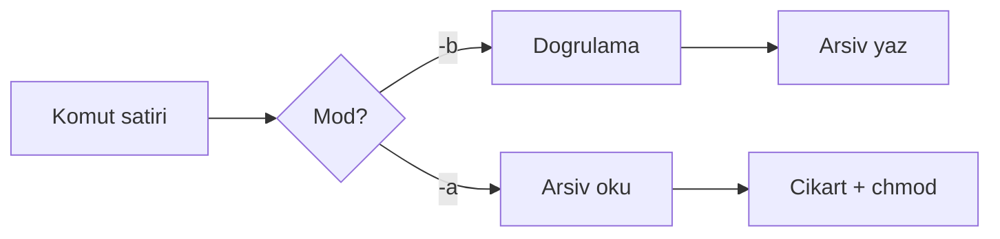

# Sistem Programlama Ders Projesi Raporu

## tarsau: Özel .sau Formatında Dosya Arşivleyici

**Öğrenci:** Zekiye Nur Kırat  
**Ders:** Sistem Programlama  
**Tarih:** Mayıs 2026

---

## 1. Problem Analizi

Günük kullanımda birden fazla metin dosyasını tek bir pakette taşımak, yedeklemek veya paylaşmak gerekebilir. `tar`, `zip` gibi araçlar yaygın olsa da, bu proje özel bir eğitim formatı (`.sau`) ile temel sistem çağrılarını ve dosya yönetimini öğrenmeyi hedefler.

**Problem:** Metin dosyalarını güvenli şekilde tek bir arşivde toplamak; arşivden çıkarırken dosya adı, boyut ve Unix izinlerini korumak.

**Kısıtlar:**

- Yalnızca metin dosyaları
- En fazla 32 dosya
- Toplam boyut ≤ 200 MB
- Linux/Unix uyumluluğu

---

## 2. Sistem Çalışma Mantığı

Program iki modda çalışır:

1. **Arşivleme (`-b`):** Girdi dosyaları doğrulanır → metadata toplanır → `.sau` dosyası yazılır.
2. **Açma (`-a`):** `.sau` doğrulanır → metadata okunur → dosyalar hedef dizine yazılır → `chmod` ile izinler geri yüklenir.



---

## 3. Kullanılan Sistem Çağrıları ve Fonksiyonlar

| API | Kullanım amacı |
|-----|----------------|
| `stat()` | Dosya boyutu ve `st_mode` (izinler) okuma |
| `chmod()` | Çıkarılan dosyaya arşivdeki izinleri uygulama |
| `access()` | Okuma izni kontrolü |
| `mkdir()` | Hedef dizin oluşturma (`mkdir -p` mantığı) |
| `fopen()` / `fclose()` | Metin ve ikili modda güvenli dosya açma |
| `fread()` / `fwrite()` | Tamponlu okuma/yazma (64 KB blok) |
| `fgets()` / `fprintf()` | Metadata metin satırları |
| `malloc()` / `free()` | Metadata listesi ve okuma tamponu |
| `remove()` | Hatalı arşiv oluşturmada geri alma |

---

## 4. Dosya Sistemi Mantığı

- **Giriş:** Yalnızca düzenli (`S_ISREG`) dosyalar; dizin veya özel dosya arşivlenmez.
- **Yol:** Göreli (`./tests/sample1.txt`) ve mutlak (`/home/user/...`) yollar desteklenir.
- **İzinler:** `st_mode & 07777` arşive octal olarak yazılır; çıkarma sonrası `chmod(path, mode)` uygulanır.
- **Hata durumu:** Kısmi yazım sonrası oluşan bozuk çıktı dosyası `remove()` ile silinir.

---

## 5. Arşivleme Algoritması (.sau)

### 5.1 Dosya düzeni

```
[10 bayt magic: SAUARCH01\n]
[dosyaAdi|mode|size|preview_hex\n]  × N
META_END
CONTENT_START
[dosya1 içeriği][dosya2 içeriği]...
```

### 5.2 İlk 10 bayt içerik alanı

Arşivin en başındaki 10 bayt, format tanımlayıcı (magic) olarak sabitlenmiştir. Açılışta bu alan okunur; uyuşmazlık **bozuk arsiv** hatası üretir.

### 5.3 Metadata ayırıcıları

Alan ayırıcısı: `|` (pipe). Kayıt sonu: satır sonu (`\n`). Bölüm sonları: `META_END` ve `CONTENT_START` satırları.

### 5.4 Önizleme (preview)

Her dosyanın ilk 10 baytı hex olarak metadata satırında saklanır; kısa dosyalarda kalan baytlar `0` ile doldurulur.

---

## 6. Örnek Kod Parçaları

### 6.1 Metin dosyası kontrolü

```c
/* Yazdırılabilir ASCII veya TAB/LF/CR */
if (c >= 0x20 && c <= 0x7E) continue;
```

### 6.2 Arşiv başlığı yazımı

```c
fwrite(TARSAU_MAGIC_HEADER, 1, TARSAU_MAGIC_SIZE, out);
```

### 6.3 İzin geri yükleme

```c
chmod(out_path, meta->mode);
```

---

## 7. Test Senaryoları ve Çıktılar

Otomatik test betiği: `tests/run_tests.sh`

| Test | Beklenen |
|------|----------|
| İki dosya arşivle / aç | `cmp` ile birebir eşleşme |
| Varsayılan `a.sau` | Dosya oluşur |
| Binary girdi | Reddedilir |
| `.zip` çıktı adı | Reddedilir |
| Bozuk magic | Reddedilir |
| Parametresiz çalıştırma | Kullanım mesajı, çıkış ≠ 0 |

Örnek başarılı çıktı (`rapor/test_ciktilari.txt` dosyasında tam log):

```
tarsau: 2 dosya basariyla arsivlendi -> tests/out/test.sau
tarsau: 2 dosya basariyla cikarildi -> tests/out/extracted
=== Tum testler basarili ===
```

---

## 8. Ekran Görüntüleri (PDF için)

Raporun PDF sürümüne eklenmesi önerilen ekran görüntüleri:

1. `make && make test` terminal çıktısı  
2. `./bin/tarsau -b` ile arşiv oluşturma  
3. `./bin/tarsau -a` ile çıkarma sonrası `ls -l` izin karşılaştırması  
4. Hatalı giriş (binary dosya) stderr mesajı  

> **Not:** `rapor/ekran_goruntuleri/` klasörüne PNG dosyalarını ekleyip bu bölüme referans verin.

---

## 9. GitHub Kullanım Süreci

1. GitHub’da boş depo oluşturun (ör. `SistemProg-tarsau`).
2. Yerel dizinde:
   ```bash
   git init
   git add .
   git commit -m "Initial commit: tarsau project"
   git remote add origin https://github.com/KULLANICI/SistemProg-tarsau.git
   git push -u origin main
   ```
3. Anlamlı commit mesajları: `feat: archive module`, `fix: metadata count on extract`, `docs: add report`.
4. README.md depo ana sayfasında kullanımı açıklar.

---

## 10. Sonuç

`tarsau` programı, modüler C yapısı ile `.sau` formatında güvenli arşivleme ve açma işlemlerini gerçekleştirir. Bellek sızıntısı önlenmiş, hata durumlarında program kontrollü sonlanır, dosya izinleri `stat`/`chmod` ile taşınır. Tüm otomatik testler Linux (WSL) ortamında başarıyla tamamlanmıştır.

---

## Ek A: PDF’e Dönüştürme

```bash
# pandoc yüklü ise:
pandoc rapor/RAPOR.md -o rapor/RAPOR.pdf --pdf-engine=xelatex -V lang=tr
```

Alternatif: Markdown dosyasını Word/Google Docs’a aktarıp PDF olarak dışa aktarın.

## Ek B: ZIP / RAR Paketleme

Teslim için proje kökünden:

```bash
zip -r SistemProg_Proje_teslim.zip . -x "obj/*" "bin/*" "tests/out/*" ".git/*"
```

Windows’ta: klasöre sağ tık → Sıkıştırılmış klasöre gönder.
